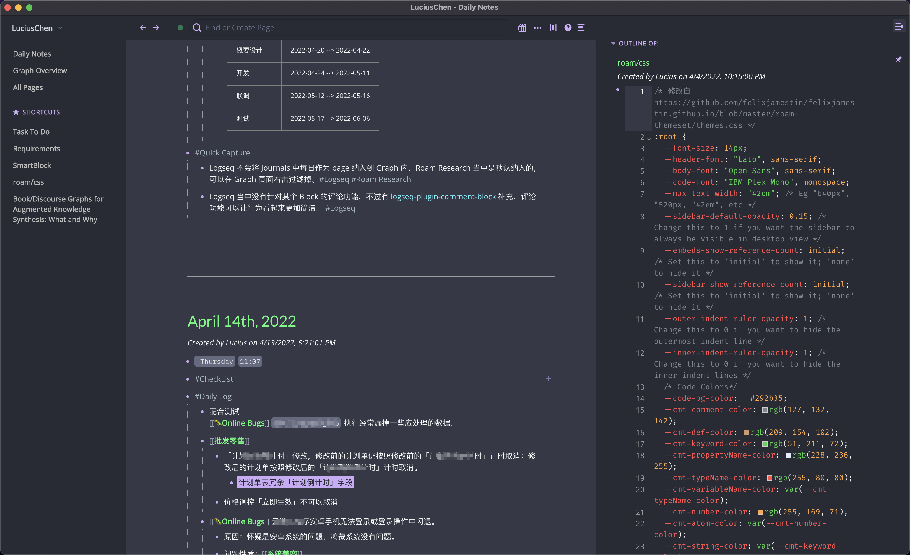
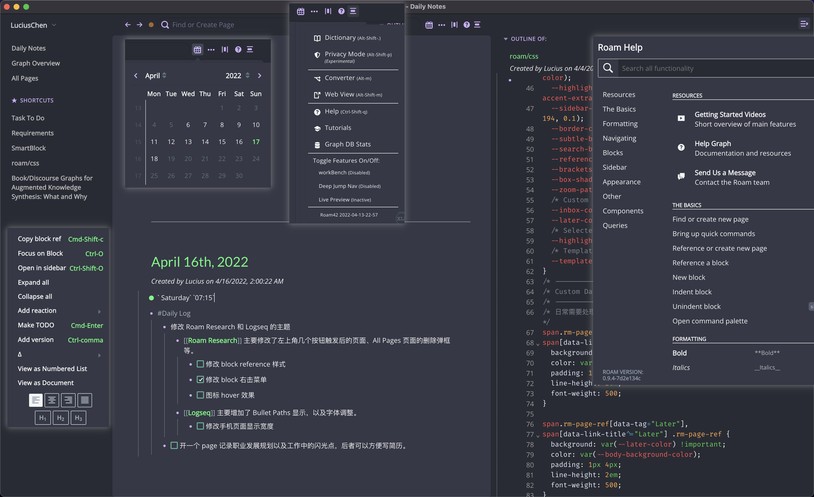
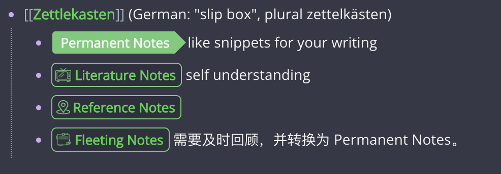
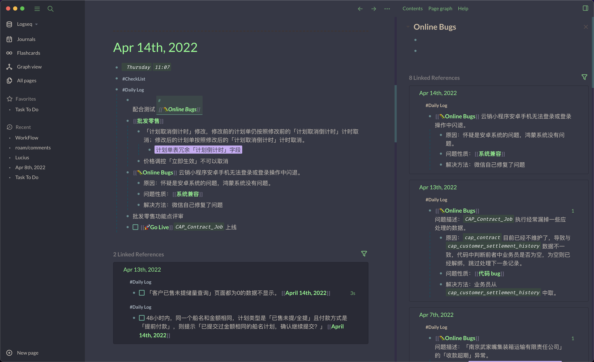
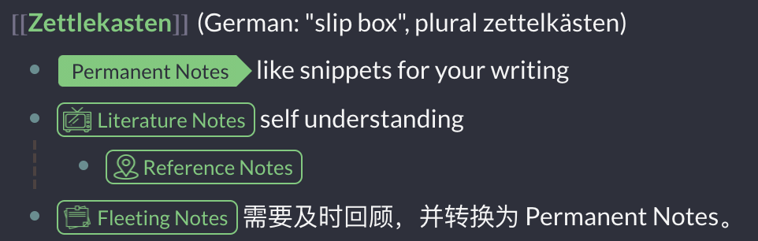
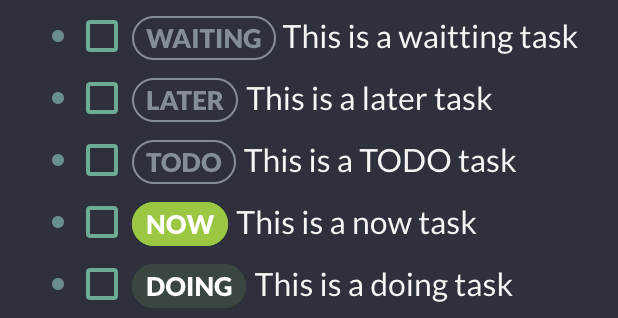

# roam-logseq-themes

## Roam

## Logseq

## 特点
1. 所有页面或者弹窗统一风格。
2. Block Reference 背景突出并前置`#`标识。
3. `Inbox`、`Later` 等标签样式特殊化，可以根据自己需求自定义。

## Roam Research

### Dark Theme
   - [x] 修改 block 右击菜单匹配主题
   - [x] 调整 Block Reference 的背景以及前置`#`标识。
   - [x] 已完成的 TODO 增加删除线并文字置灰
   - [x] 调整了 `/`（SmartBlock）及 `;;` 唤起的弹框样式，与整体风格保持一致。
   - [x] 增加`Permanent Notes`、`Literature Notes`、`Reference Notes` 和 `Fleeting Notes` 样式。
## Logseq

### Dark Theme
   - [x] 适配手机，减少内容两边边距，展示更多内容。
   - [x] 将 blockquote 样式改为双引号。
   - [x] 将 Date Picker 样式改为和主题一致配色。
   - [x] 修改搜索框背景，选中悬停颜色，区分于软件整理的背景颜色。
   - [x] 增加`Permanent Notes`、`Literature Notes`、`Reference Notes` 和 `Fleeting Notes` 样式，并增加悬停效果，包括前置图标；增加对应的 Pages title 图标。
     - [x] 大家可以在 [Tabler ICONS](https://tabler-icons.io/) 中找自己喜欢的 icons 进行替换或增加，官方应该引入的 icon 库就是这个，可以直接用这个网站中的 icon code，比如 `\ea51`。
   - [x] 修改标签默认样式
   - [x] 修改 `WAITTING`、`LATER`、`TODO`、`NOW`、`DOING` 样式。
   - [x] `custom.js` 增加对 `namespaces` 的隐藏，例如 `APP/Obsidian` 省略后 `.../Obsidian`。
   - [x] `custom.js` 增加对 [logseq-plugin-comment-block](https://github.com/vipzhicheng/logseq-plugin-comment-block) 展示修改，该插件在 siderbar 中被评价内容显示重复。
   - [x] 隐藏 page 两边的 `[[]]`。
   - [x] 增加 Journals title 图标
### Light Theme
   - [x] 大致调整了一下颜色搭配，大致可以用了，细节待完善。